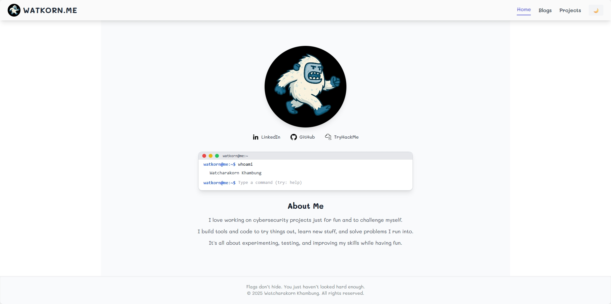
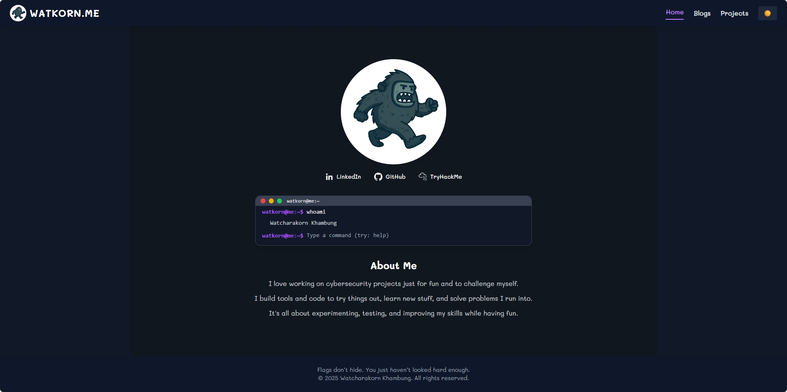

# 🌐 WATKORN Portfolio Website

[](LICENSE)
[](https://watkorn.me)

> A modern portfolio website showcasing **Home**, **Blogs & Articles**, and **Projects & Tools**.  
> Includes a left-side navigation menu and theme toggle (Dark/Light).  
> Built with **React + Tailwind CSS**, fully responsive across desktop, tablet, and mobile.

---

## 🖼️ Screenshots

| Light Mode | Dark Mode |
|-------------|------------|
|  |  |

---

## ✨ Features

- Responsive layout with adaptive Left Navigation
- Dark/Light Theme Toggle with theme-aware logo
- Pages:
  - **Home**
  - **Blogs** (grouped by year + “Load More”)
  - **Projects** (categories + responsive grid)
- Reusable Components:
  - Header, Footer, Card, ScrollToTop, ThemeToggle
- Styled with **Tailwind CSS**

---

## 📂 Project Structure (short)

```
public/
  ├─ index.html
  ├─ favicon.png
  ├─ screenshot_light.png
  └─ screenshot_dark.png
src/
  ├─ assets/
  ├─ components/
  ├─ pages/
  ├─ data/
  ├─ styles/
  ├─ theme/
  ├─ utils/
  ├─ App.jsx
  └─ index.jsx
CNAME
LICENSE
README.md
.gitignore
package.json
package-lock.json
postcss.config.js
tailwind.config.js
```

---

## ⚙️ Install & Run (PowerShell / pwsh)

Open **PowerShell** or your terminal in the project folder and run:

```pwsh
# Install dependencies
npm install
npm install react-infinite-scroll-component react-helmet-async
npm install eslint eslint-plugin-react-hooks --save-dev
npm install -D tailwindcss postcss autoprefixer
npx tailwindcss init -p

# (Optional) Allow PowerShell to run scripts
Set-ExecutionPolicy -ExecutionPolicy RemoteSigned -Scope CurrentUser -Force

# Start development server
npm start
```

Then open **http://localhost:3000** in your browser.

---

## 📜 Expected npm scripts (package.json)

```json
"scripts": {
  "start": "react-scripts start",
  "build": "react-scripts build",
  "lint": "eslint .",
  "deploy": "gh-pages -d build"
}
```

- `npm start` — start dev server  
- `npm run build` — build production bundle  
- `npm run lint` — run linter (if configured)

---

## 🚀 Deployment (Recommended Options)

### **Option 1 — Vercel**
Fastest way: import the GitHub repo and deploy directly.

### **Option 2 — Netlify**
Set **Build Command:** `npm run build`  
Set **Publish Directory:** `build/`

### **Option 3 — GitHub Pages**

1. Install the package:
   ```pwsh
   npm install --save-dev gh-pages
   ```

2. Check your `package.json`:
   ```json
   "scripts": {
     "start": "react-scripts start",
     "build": "react-scripts build",
     "deploy": "gh-pages -d build"
   }
   ```

3. Deploy:
   ```pwsh
   npm run deploy
   ```

---

## 🧭 Push to GitHub (PowerShell)

If you don’t have a remote repository yet, run:

```pwsh
# Initialize repo (if needed)
git init
git branch -M main
git remote add origin https://github.com/<YOUR_USER>/<YOUR_REPO>.git

# Push to GitHub
git add .
git commit -m "Initial commit: React source code"
git push -u origin main
```

> Replace `<YOUR_USER>` and `<YOUR_REPO>` with your GitHub username and repository name.

---

## 🔥 In Case of Fire / Git Problems

```pwsh
cd "C:\path\to\your\project"
Remove-Item -Recurse -Force .git
```

Then repeat the **Push to GitHub** steps above.

---

## ♻️ Update & Redeploy

1. Rebuild the project:
   ```bash
   npm run build
   ```

2. Deploy to GitHub Pages:
   ```bash
   npm run deploy
   ```

If your `package.json` already includes the `"deploy"` script, this will automatically push to the **gh-pages** branch.

---

## 🤝 Contributing

Contributions are welcome!  
Please open an issue first for large changes, and submit a pull request with a description and testing steps.

---

## 🎨 Customization Tips

- Replace `public/screenshot_light.png` & `public/screenshot_dark.png` with real screenshots of your site.  
- Update this README with your **live demo URL** and any relevant badges.  
- Add tests (unit/integration) to ensure code quality.

---

## 🧰 Technologies Used

- React 18+
- React Router DOM v6
- Tailwind CSS
- JavaScript (ES6+)

---

## 📄 License

This project is licensed under the **MIT License** — see [LICENSE](LICENSE) for details.

---

## 📬 Contact

- **Email:** fkub0011@gmail.com  
- **GitHub / LinkedIn:** [watkorn](https://github.com/watkorn)

---

## 💻 Try It Locally

After running:
```bash
npm start
```
Open: [http://localhost:3000](http://localhost:3000)
